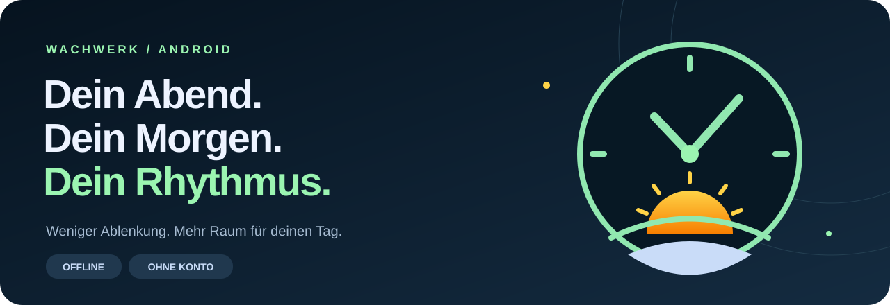
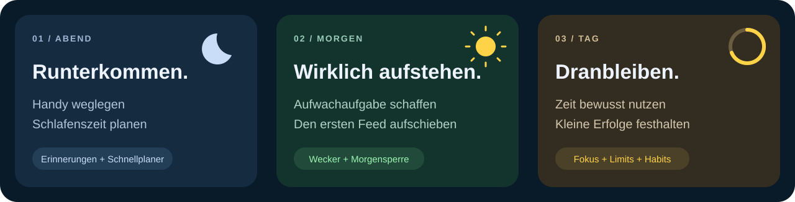

# Wachwerk

**Ein Wecker, der dich durch den Tag begleitet.**

Wachwerk verbindet Wecker, Einschlaf-Erinnerungen, einen Standby-Modus, Fokus-Timer und einen App-Blocker mit To-dos und täglichen Habits. Das Ziel: weniger am Handy hängen, bewusster aufstehen und den eigenen Alltag strukturieren.

**Android 8.0+ · Offline · Kein Benutzerkonto · Version 1.13.0 · In Entwicklung**

[Installation](docs/INSTALLATION.md) · [Selbst bauen](docs/ENTWICKLUNG.md) · [Änderungen](CHANGELOG.md) · [Datenschutz](docs/DATENSCHUTZ.md)

## Die Idee

Abends fällt es schwer, das Handy wegzulegen. Morgens ist der Wecker schnell ausgeschaltet – und der nächste Feed schon offen. Wachwerk setzt an beiden Stellen an: mit Erinnerungen am Abend, einer bewussten Aufwachaufgabe und einer optionalen Handy-Pause nach dem Aufstehen.



*Die Grafiken zeigen das Konzept. Sie sind keine Screenshots oder Messwerte eines echten Nutzers.*

## Was steckt drin?

| Bereich | Funktionen |
| --- | --- |
| **Wecker** | Einmalige und wiederkehrende Alarme, Bearbeiten und Löschen, eigene Alarmtöne, einstellbares Snooze und sanftes Bildschirmlicht. |
| **Aufwachaufgaben** | Handy schütteln, Display gedrückt halten, einer Schlange folgen oder den eigenen QR-Code beziehungsweise NFC-Tag scannen. |
| **Schnellplaner** | „Ich schlafe jetzt“ schlägt Weckzeiten vor. „Aufstehen um“ zeigt passende Bettzeiten. Zyklus- und Einschlafdauer sind einstellbar. |
| **Abend-Erinnerungen** | Konfigurierbarer Beginn, gleichmäßige oder kürzer werdende Abstände und Berücksichtigung längerer Bildschirm-aus-Phasen. |
| **Standby** | Querformat mit wählbaren Uhren, Kalender und weiteren Widgets. Lange drücken zum Anpassen, kurz tippen zum Verlassen. |
| **App-Blocker** | Direkt-Sperre, Tageslimits und erlaubte Uhrzeiten. Die Bereiche haben getrennte Regeln und Freigaben per NFC, QR oder Passwort. |
| **Morgensperre** | Ausgewählte Apps nach einer erfolgreichen Aufwachaufgabe für eine selbst gewählte Dauer sperren. Andere Apps bleiben frei. |
| **Fokus** | Arbeits- und Pausenzeiten, Runden, Countdown, optionale App-Sperren und Nicht-stören. |
| **To-dos & Habits** | Aufgaben, Erinnerungen, tägliche Gewohnheiten und eine Monatsübersicht der Erfolge. |
| **Coach & Design** | Auswertung eigener Morgenchecks, verschiedene Farbpaletten, Schriften sowie Hoch- und Querformat. |

Der Coach arbeitet mit deinen Einträgen und einstellbaren Annahmen. Er misst keine echten Schlafphasen und bestimmt keinen medizinisch validierten „perfekten“ Schlafbedarf.

## APK installieren

Die installierbare Datei findest du im GitHub-Bereich **Releases** unter **Assets**:

`Wachwerk-v1.13.0-Offline-signiert.apk`

APK auf das Android-Handy laden, öffnen und die Installation für die verwendete Quelle erlauben. Bei einer vorhandenen Wachwerk-Version als **Update** installieren – nicht vorher deinstallieren. Die ausführliche Anleitung erklärt auch die benötigten Android-Zugriffe: [Installation und erster Test](docs/INSTALLATION.md).

> **Entwicklungsstand:** 25 Android-Unit-Tests und 5 Web-Logiktests bestanden beim Build von 1.13.0. NFC, Alarmton im Hintergrund und herstellerspezifisches Energiesparen müssen auf dem Zielgerät geprüft werden. Vor wichtigen Terminen zunächst einen Ersatzwecker verwenden.

## Lokal – auch ohne Server

Die APK lädt ihre Oberfläche direkt aus den mitgelieferten Dateien. Die eigentlichen Android-Funktionen – etwa Alarmplanung, NFC und Nutzungsdaten – sind nativ in Java implementiert.

- Kein Login und kein eigener Cloud-Dienst.
- Keine `INTERNET`-Berechtigung in der APK.
- Einstellungen und Einträge werden auf dem Gerät gespeichert.
- Keine eingebundenen Werbe- oder Analyse-SDKs.

Androids systemeigene Sicherung kann unabhängig davon aktiv sein. Details zu Speicherung, Berechtigungen und Grenzen stehen unter [Datenschutz](docs/DATENSCHUTZ.md).

## Quellcode & Entwicklung

```text
wachwerk-android/      Android-App, native Dienste und Tests
wachwerk-local-web/    React-/TypeScript-Oberfläche und Tests
docs/                 Anleitungen, Grafiken und Lizenzhinweise
CHANGELOG.md          Versionsänderungen
```

Android Studio öffnet den Ordner `wachwerk-android`. Die fertige Offline-Oberfläche ist bereits enthalten; für den ersten Android-Build ist kein Web-Build nötig. Benötigt werden **JDK 17** und **Android SDK 35**.

```powershell
cd wachwerk-android
.\gradlew.bat testDebugUnitTest assembleDebug
```

Die Debug-APK liegt danach unter `app/build/outputs/apk/debug/app-debug.apk`. Sie hat einen anderen Signaturschlüssel als die Release-APK und kann diese nicht als Update ersetzen.

Für Änderungen an der Oberfläche, macOS/Linux und eigene Release-Builds: [Entwicklungsanleitung](docs/ENTWICKLUNG.md).

## Fehler melden

Hilfreich sind App-Version, Handy-Modell, Android-/One-UI-Version und kurze Schritte zum Nachstellen. Bei Weckerproblemen bitte dazuschreiben, ob das Display gesperrt war und welche Aufwachaufgabe gewählt wurde. Keine persönlichen QR-Inhalte, NFC-Kennungen, Passwörter oder privaten Screenshots veröffentlichen.

## Lizenzstatus

Für den eigenen Wachwerk-Code ist bisher **keine Open-Source-Lizenz festgelegt**. Drittanbieter-Komponenten behalten ihre jeweiligen Lizenzen. Siehe [Lizenzstatus](LICENSE-STATUS.md) und [Drittanbieter-Hinweise](THIRD_PARTY_NOTICES.md).
